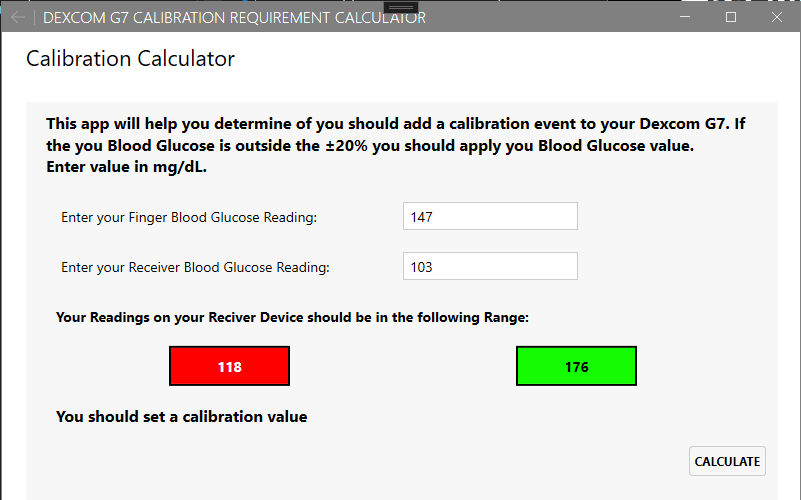


# Dexcom G7 Calibration Requirement Calculator

The WPF application allow you to determine of your Dexcom G7 needs to be calibration. Just enter you finger stick value and the value from your Dexcom Receiver and the application will show you the range your receiver should be in.

 
